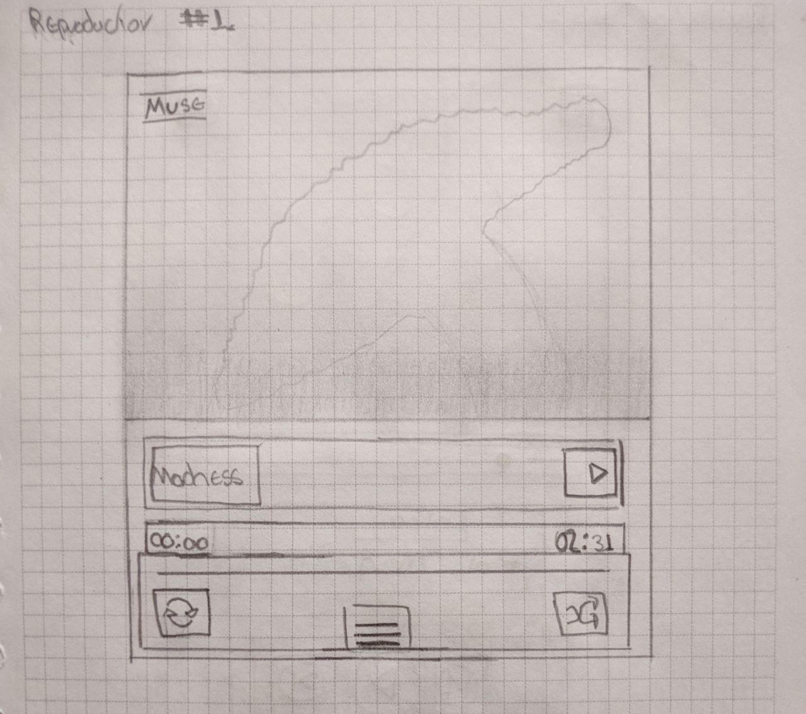
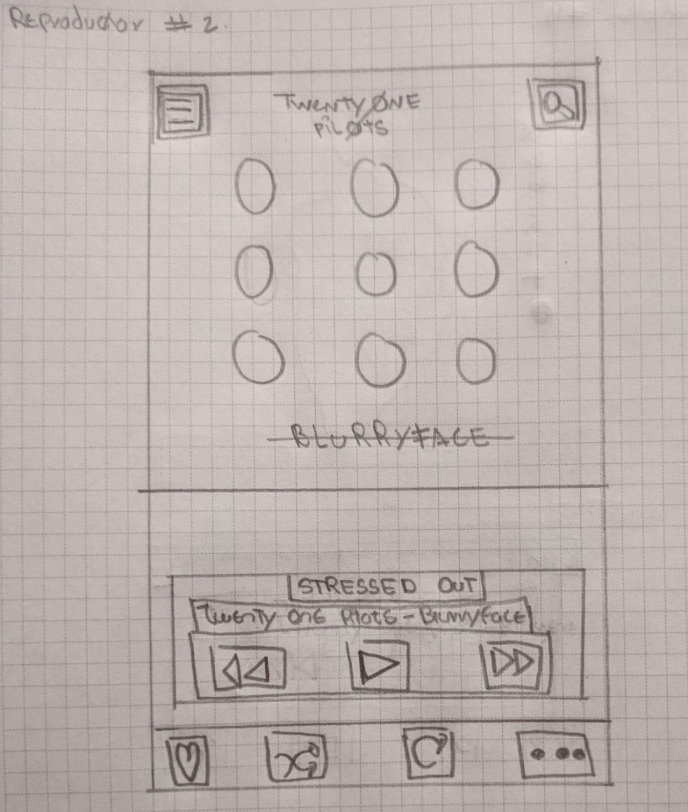
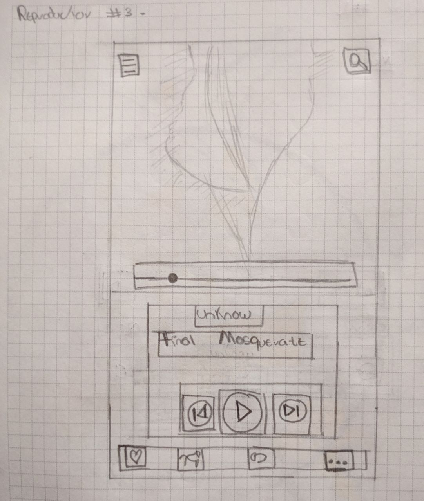
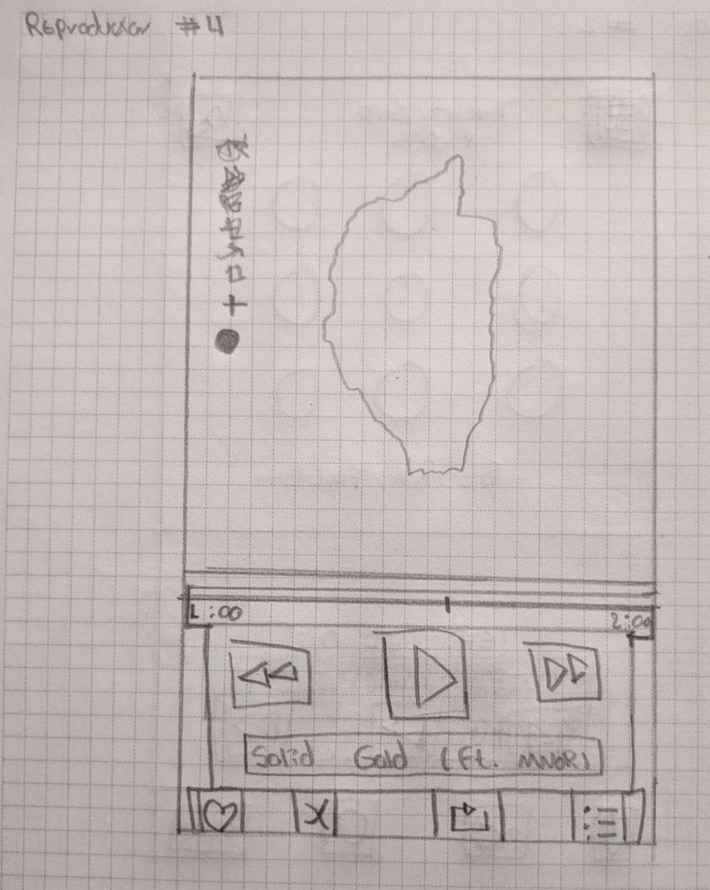
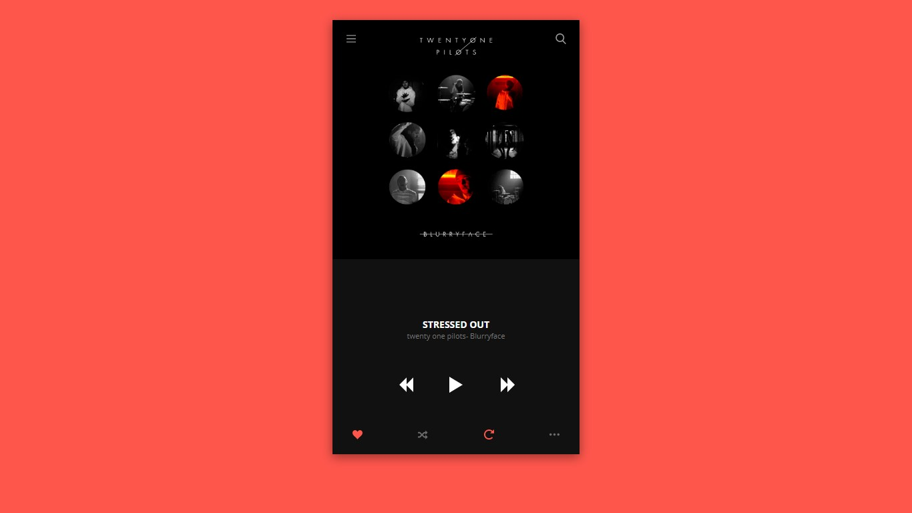
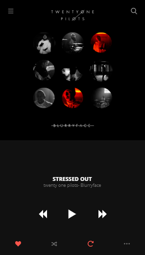
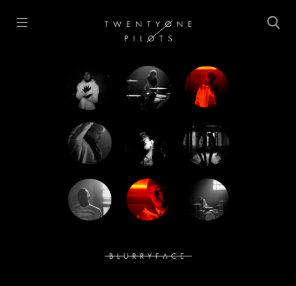
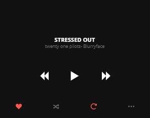

# MUSIC PLAYER - TWENTY ONE PILOTS

Maquetación e interacción básica de un reproductor multimedia(reproducción de un archivo mp3).

### Bocetos planteados a mano

(Descartado).

(Escogido).

(Descartado).

(Descartado).

### **Desarrollo de maqueta escogida.**

En primera instancia se dividió el reproductor en dos partes: top y bottom.

#top

>   height: 55%;

#bottom

>   height: 45%;

# Display flex como gran ayuda

Para el desarrollo de este reproductor se utilizó en la mayoría de contendedores un display: flex
ya que nos permitía ubicar los elementos hijos como en el modelo a seguir de una manera sencilla.

Por ejemplo:

>   display: flex;
>   justify-content: space-between;

 >  display: flex;
 >  align-items: center;
 >  justify-content: space-around;

>A diferencia del ejemplo anterior, se usa space-around para que también haya una separación con el borde de su
>contenedor y así evitar usar un padding en los laterales.

>Todos los botones del footer reaccionan al click y al hover.

**Elaborado por:** Santiago Gálvez, Francisco Jiménez.